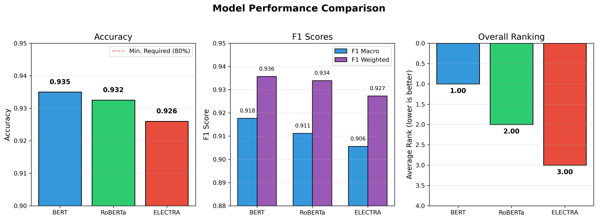
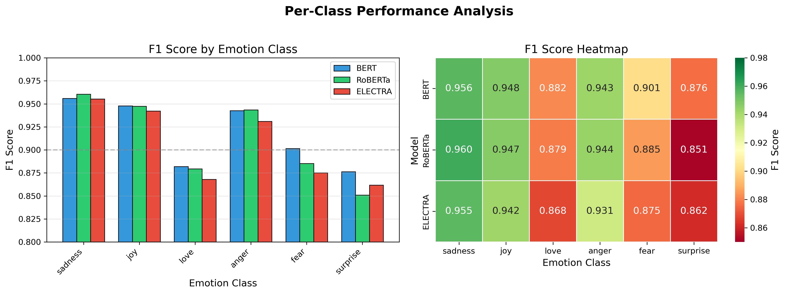
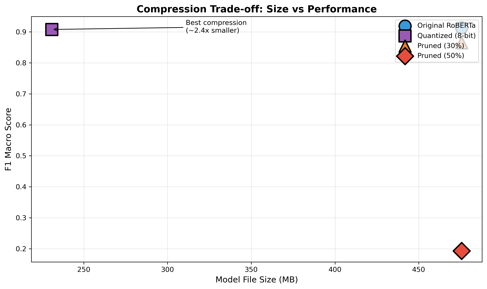

# 🎭 Emotion Classification in Twitter Data Using Transformers

[](https://www.python.org/downloads/)
[](https://pytorch.org/)
[](https://huggingface.co/transformers/)
[](https://opensource.org/licenses/MIT)

A comprehensive study comparing **BERT**, **RoBERTa**, and **ELECTRA** for emotion classification on Twitter data, with model compression analysis using quantization and pruning.

<p align="center">
  
</p>

## 📊 Results at a Glance

| Model | Accuracy | F1 Macro | F1 Weighted | Size |
|-------|----------|----------|-------------|------|
| BERT | 93.40% | 91.08% | 93.50% | 417.7 MB |
| **RoBERTa** 🏆 | **93.40%** | **91.32%** | **93.52%** | 475.5 MB |
| ELECTRA | 93.10% | 90.82% | 93.21% | 417.7 MB |

**Best Model:** RoBERTa achieves the highest F1 Macro score, excelling particularly on minority classes.

### Compression Results (RoBERTa)

| Method | Size | Compression | Accuracy | F1 Macro |
|--------|------|-------------|----------|----------|
| Original | 475.6 MB | 1.0× | 93.40% | 91.32% |
| **Quantized (INT8)** ✅ | 230.9 MB | **2.06×** | 92.90% | 90.74% |
| Pruned (30%) | 475.6 MB | 1.0× | 90.20% | 86.49% |
| Pruned (50%) ⚠️ | 475.6 MB | 1.0× | 40.20% | 19.36% |

> 💡 **Key Finding:** Quantization achieves 2× size reduction with minimal accuracy loss. Aggressive pruning causes model collapse.

---

## 🎯 Project Overview

### Problem
Classify tweets into 6 emotion categories: **sadness**, **joy**, **love**, **anger**, **fear**, and **surprise**.

### Challenges
- **Class Imbalance**: Joy (33.5%) vs Surprise (3.6%)
- **Informal Text**: Slang, abbreviations, missing punctuation
- **Short Context**: Tweets limited to 280 characters

### Solution
- Fine-tune pre-trained transformers with **weighted cross-entropy loss**
- **Data preprocessing** pipeline for Twitter text normalization
- **Model compression** for efficient deployment

---

## 🚀 Quick Start

### 1. Installation

```bash
# Clone the repository
git clone https://github.com/yourusername/emotion-classification.git
cd emotion-classification

# Create virtual environment
python -m venv venv
source venv/bin/activate  # On Windows: venv\Scripts\activate

# Install dependencies
pip install -r requirements.txt
```

### 2. Train Models

```bash
# Train all three models
python train_bert.py 
python train_roberta.py 
python train_electra.py 

```

### 3. Model Compression

```bash
# Apply quantization & pruning
python model_compression.py 

```

### 4. Evaluate

```bash

# Compare all models
python compare_models.py

```

### 5. Run Inference

```bash

# Batch inference from CSV
python run_inference.py --weights weights/roberta_best.pt --csv data/validation.csv

```

---

## ⚙️ Configuration

All hyperparameters are defined in `config.py`:

```python
# Model Configuration
MODEL_NAME = "roberta-base"
NUM_CLASSES = 6
MAX_LENGTH = 128

# Training Configuration
BATCH_SIZE = 32
LEARNING_RATE = 2e-5
WEIGHT_DECAY = 0.05
NUM_EPOCHS = 3
WARMUP_RATIO = 0.1

# Class Labels
EMOTION_LABELS = ['sadness', 'joy', 'love', 'anger', 'fear', 'surprise']
```

---

## 📈 Visualizations

### Per-Class Performance
<p align="center">
  
</p>

### Compression Trade-off
<p align="center">
  
</p>

### Confusion Matrix (RoBERTa)
<p align="center">
  
</p>

---

## 🔬 Methodology

### Data Preprocessing Pipeline

```python
def clean_text(text):
    # 1. Expand contractions: "Im" → "I'm", "dont" → "don't"
    # 2. Remove URLs and @mentions
    # 3. Remove emojis
    # 4. Reduce repeated characters: "happyyy" → "happyy"
    # 5. Remove extra whitespace
    return cleaned_text
```

### Weighted Cross-Entropy Loss

To handle class imbalance, we compute class weights as inverse frequency:

$$w_c = \frac{N_{total}}{C \times N_c}$$

This gives minority classes (like surprise) higher weights, forcing the model to learn their patterns.

### Model Architecture

```
Input Text
    ↓
[CLS] token + WordPiece Tokenization + [SEP]
    ↓
Transformer Encoder (12 layers, 768 hidden dim)
    ↓
[CLS] Hidden State (768-dim)
    ↓
Linear Layer (768 → 6) + Softmax
    ↓
Emotion Prediction
```

---

## 📊 Dataset

The dataset contains **18,000 English tweets** labeled with 6 emotions:

| Emotion | Train | Val | Percentage | Weight |
|---------|-------|-----|------------|--------|
| Joy | 5,362 | 695 | 33.5% | 0.50 |
| Sadness | 4,666 | 581 | 29.2% | 0.57 |
| Anger | 2,159 | 275 | 13.5% | 1.23 |
| Fear | 1,937 | 224 | 12.1% | 1.38 |
| Love | 1,304 | 159 | 8.2% | 2.04 |
| Surprise | 572 | 66 | 3.6% | 4.66 |

---

## 🔧 Requirements

```txt
torch>=2.0.0
transformers>=4.30.0
pandas>=1.5.0
numpy>=1.23.0
scikit-learn>=1.2.0
matplotlib>=3.6.0
seaborn>=0.12.0
tqdm>=4.64.0
```

---

## 📝 Citation

If you use this code in your research, please cite:

```bibtex
@article{emotion-classification-2026,
  title={Emotion Classification in Twitter Data Using Transformer-Based Models: A Comparative Study with Model Compression},
  author={Oizerovich, Adi and Michael, Roei},
  year={2026},
  institution={Hebrew University of Jerusalem}
}
```

---

## 📚 References

- Devlin et al. (2019). [BERT: Pre-training of Deep Bidirectional Transformers](https://arxiv.org/abs/1810.04805)
- Liu et al. (2019). [RoBERTa: A Robustly Optimized BERT Pretraining Approach](https://arxiv.org/abs/1907.11692)
- Clark et al. (2020). [ELECTRA: Pre-training Text Encoders as Discriminators](https://arxiv.org/abs/2003.10555)
- Gordon et al. (2020). [Compressing BERT: Studying the Effects of Weight Pruning](https://arxiv.org/abs/2002.11985)

---

## 📄 License

This project is licensed under the MIT License - see the [LICENSE](LICENSE) file for details.

---

## 👥 Authors

- **Adi Oizerovich** - [adi.oizerovich@gmail.com](mailto:adi.oizerovich@gmail.com)
- **Roei Michael** - [roeym111@gmail.com](mailto:roeym111@gmail.com)

---

<p align="center">
  Made with ❤️ for NLP Course @ Bar Ilan University
</p>

<p align="center">
  <a href="#-emotion-classification-using-transformers">Back to Top ↑</a>
</p>
